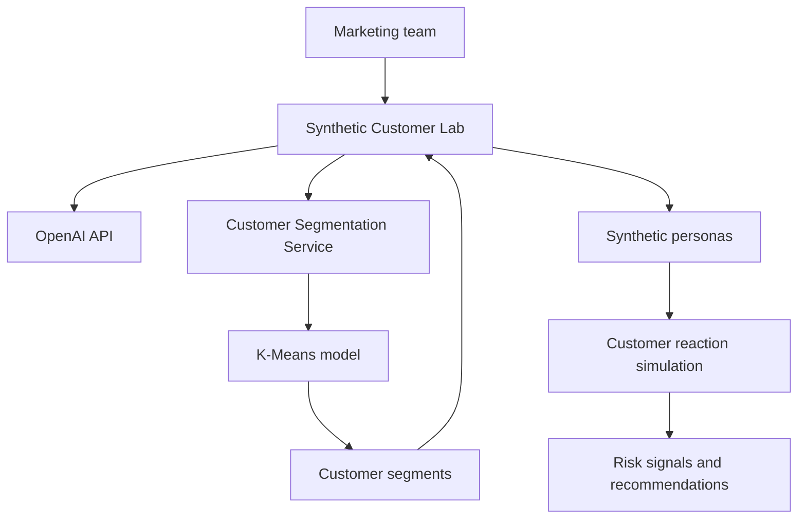

# Synthetic Customer Lab

An AI-assisted pre-launch testing platform for banking campaigns, developed as a hackathon MVP for the **University of Auckland × BNZ Hackathon**.

Synthetic Customer Lab helps banking teams evaluate marketing messages, customer communications, and user-interface experiences before they reach real customers. It simulates how different customer segments may understand, trust, and respond to a campaign, then highlights risks and recommends improvements.

> [!IMPORTANT]
> This prototype supports early customer research and decision-making. It does not replace real customer testing, accessibility validation, compliance review, or operational review.

## Key Features

- **AI message analysis** — evaluates clarity, trust, emotional impact, fairness, financial wellbeing, and communication effectiveness.
- **Machine-learning segmentation** — uses customer behaviour patterns and K-Means clustering to identify meaningful customer groups.
- **Dynamic persona generation** — creates synthetic personas based on the campaign, audience, segment, channel, and timing.
- **Customer reaction simulation** — estimates trust, understanding, emotional response, accessibility concerns, and likelihood of action.
- **Campaign optimisation** — suggests clearer wording, stronger calls to action, better benefits, and reduced ambiguity.
- **Optional screenshot analysis** — reviews information hierarchy, readability, button clarity, and accessibility risks.
- **Risk scoring** — surfaces customer, accessibility, and operational risks before launch.

## How It Works



The solution consists of two connected services:

1. **Synthetic Customer Lab** — provides the frontend, backend API, AI integration, persona generation, simulations, risk scoring, and recommendations.
2. **[Bank Customer Segmentation Service](https://github.com/Maishi226/bank-segmentation-service)** — performs behaviour analysis, feature engineering, K-Means clustering, segment assignment, and customer profile generation.

The segmentation service must be running before simulations can be performed.

## Example Use Case

**Feature:** Smart overdraft warning  
**Message:** “Your account may go into overdraft before Friday. Consider transferring $120 from savings.”  
**Target audience:** Customers with a low balance and upcoming bills  
**Channel:** Mobile notification  
**Timing:** Two days before the expected overdraft

The platform tests the message against multiple synthetic customer groups and reports:

- How well each group understands the message
- Expected trust and emotional response
- Possible financial-wellbeing or accessibility concerns
- Likely customer actions
- Risks and suggested message improvements

## Technology Stack

| Area | Technologies |
| --- | --- |
| Frontend | React, TypeScript, Vite, Tailwind CSS |
| Backend | FastAPI, Python, REST API |
| Machine learning | Scikit-learn, K-Means clustering |
| AI | OpenAI API |
| Authentication | Supabase Authentication |

## Project Structure

```text
bnz-hkt/
├── frontend/
│   └── src/
│       ├── api/
│       ├── components/
│       ├── pages/
│       └── types/
├── backend/
│   └── app/
│       ├── main.py
│       ├── models.py
│       ├── openai_client.py
│       ├── personas.py
│       └── scoring.py
└── README.md
```

## Getting Started

### Prerequisites

- Python 3.10 or later
- Node.js and npm
- An OpenAI API key
- A local copy of the [segmentation service](https://github.com/Maishi226/bank-segmentation-service)

### 1. Start the Segmentation Service

```bash
cd bank-segmentation-service
source .venv/bin/activate
uvicorn app.main:app --reload --port 8000
```

The service will be available at `http://127.0.0.1:8000`.

### 2. Configure and Start the Backend

Create `backend/.env`:

```env
OPENAI_API_KEY=your_openai_api_key
OPENAI_MODEL=gpt-5.5
SEGMENTATION_SERVICE_URL=http://127.0.0.1:8000
```

Then start the backend:

```bash
cd bnz-hkt/backend
source .venv/bin/activate
uvicorn app.main:app --reload --port 8001
```

The backend will be available at `http://127.0.0.1:8001`.

> [!NOTE]
> The OpenAI API key is stored and used only by the backend. It must never be exposed to the frontend or committed to version control.

### 3. Start the Frontend

```bash
cd bnz-hkt/frontend
npm install
npm run dev
```

Open `http://localhost:5173` in your browser.

## API Overview

### Generate Personas

`POST /api/generate-personas`

Example request:

```json
{
  "featureName": "First Home Buyer Campaign",
  "bankingMessage": "Buy your first home with BNZ",
  "targetCustomers": "Young professionals",
  "channel": "Email",
  "sendTiming": "Monday morning",
  "personaCount": 5
}
```

Returns synthetic customer personas, customer characteristics, and segment information.

### Analyse an Advertisement

`POST /api/analyze-ad`

Returns marketing analysis, risk signals, and improvement recommendations.

### Run a Simulation

`POST /api/run-simulation-jobs`

Runs the full pipeline:

```text
Customer segments → Synthetic personas → AI simulation
                  → Customer reactions → Optimisation suggestions
```

Returns an overall campaign score, persona reactions, risk factors, and improved message suggestions.

## Risk Framework

| Risk area | Example signals |
| --- | --- |
| Customer | Confusing language, low trust, financial stress, unexpected reactions |
| Accessibility | Poor readability, unclear actions, complex explanations |
| Operational | Customer complaints, misunderstood conditions, increased support demand |

## Limitations and Responsible Use

Synthetic personas are simulated and do not represent real individuals. Their responses are indicative rather than predictive, and generated demographic or behavioural details may not reflect information a bank actually knows about its customers.

Use this platform as:

- A campaign risk-screening tool
- A communication-improvement assistant
- An early pre-launch testing layer

High-impact banking decisions should still include real customer research, accessibility testing, compliance review, and operational review.

## Future Improvements

- Connect to anonymised banking behaviour data
- Compare multiple messages through A/B testing
- Incorporate real customer feedback loops
- Add compliance-policy checking
- Use reinforcement learning for campaign optimisation
- Deploy to cloud infrastructure for production-scale usage

## Team

This project was developed by a **three-person team** for the **University of Auckland × BNZ Hackathon**. The team collaborated across:

- Machine-learning customer segmentation
- Backend API development and AI integration
- Frontend development and user-experience design

Together, the team combined machine learning, generative AI, and software engineering to build the Synthetic Customer Lab prototype.

## Disclaimer

This is a hackathon prototype and is not intended for production banking decisions without appropriate security, privacy, legal, compliance, accessibility, and model-risk assessments.
